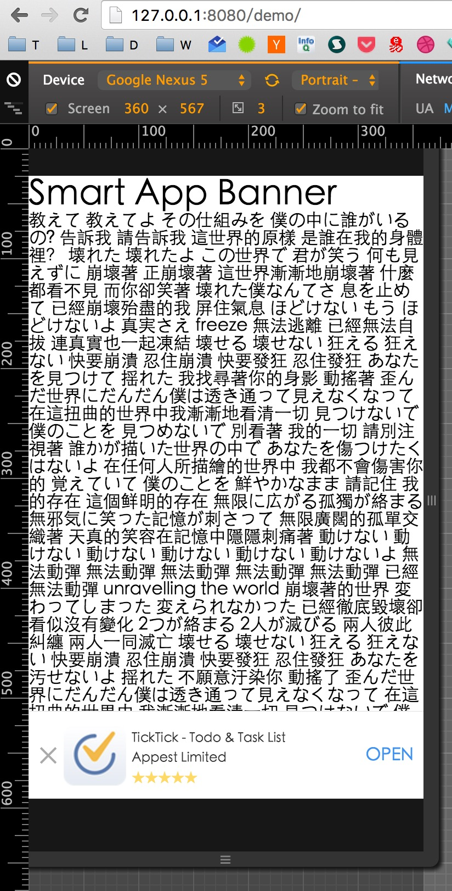

### smartbanner
===========

模拟 `iPhone` 上 `Safari` 浏览网站时显示的 `Smart App Banner`, 在各手机端浏览器打开应用, 使用 `ES6` 编写。

### Safari

在页面添加如下代码

```html
<meta name="apple-itunes-app" content="app-id=yourappid">
```

### 其他手机浏览器

```js
var banner = {
    icon: null,               // the url of the app icon
    title: null,              // the title of the app
    author: null,             // the author of the app
    appStore: null,           // the url of app for iOS
    marketUrl: null,          // the url of app for Android
    schemeIOS: null,          // the scheme url for iOS
    schemeAndroid: null,      // the scheme url for Android
    intentUrl: null,          // the intent url for chrome 25+
    button: 'OPEN',           // the button text
    rank: '★★★★★'         //  app rank
}
```

```js
 new Smartbanner(banner)
```

### Screenshot



### 原理概述

`Android` 平台下 `chrome25+` 使用 `intent://` 方式(https://developer.chrome.com/multidevice/android/intents);
其他情况，首先使用 `iframe` 尝试打开 [scheme](http://developer.android.com/guide/topics/manifest/data-element.html) 地址的方式；如果不成功，使用 `location` 地址，跳转到应用市场。

`iOS` 下首先使用 `location` 地址尝试打开 `scheme`, 不成功就跳转到应用市场。

### License
MIT